# ERD Database – Shop BM (Spring Boot backend)

Sơ đồ + đặc tả entity được suy ra từ frontend hiện tại (`/shop/*`). Mục tiêu: chuyển từng màn hình UI → entity / relationship trong DB, dùng cho Spring Boot + JPA/Hibernate + MySQL/PostgreSQL.

---

## 1. Sơ đồ ERD tổng quan (Mermaid)

```mermaid
erDiagram
    USERS ||--o| USER_SETTINGS                : "1-1 cấu hình"
    USERS ||--o{ OAUTH_ACCOUNTS               : "social login"
    USERS ||--o{ REFRESH_TOKENS               : "phiên đăng nhập"
    USERS ||--o{ PASSWORD_RESET_TOKENS        : "reset mật khẩu"

    USERS }o--o| USERS                        : "được giới thiệu bởi"
    USERS ||--o| AFFILIATE_STATS              : "thống kê aff"
    USERS ||--o{ AFFILIATE_COMMISSIONS        : "earn hoa hồng"

    USERS ||--o{ CARTS                        : "có giỏ hàng"
    CARTS ||--o{ CART_ITEMS                   : "chứa"
    PRODUCTS ||--o{ CART_ITEMS                : "trong cart"

    USERS ||--o{ ORDERS                       : "đặt hàng"
    ORDERS ||--|{ ORDER_ITEMS                 : "gồm"
    PRODUCTS ||--o{ ORDER_ITEMS               : "được mua"
    ORDER_ITEMS ||--o{ DELIVERED_CREDENTIALS  : "giao tài khoản"

    PRODUCTS ||--o{ PRODUCT_STOCK_ITEMS       : "kho từng acc"
    CATEGORIES ||--o{ PRODUCTS                : "thuộc"
    CATEGORIES }o--o| CATEGORIES              : "cha-con"

    USERS ||--o{ TRANSACTIONS                 : "lịch sử ví"
    ORDERS ||--o| TRANSACTIONS                : "payment"
    TRANSACTIONS }o--o| PAYMENT_METHODS       : "qua phương thức"

    COUPONS ||--o{ COUPON_USAGES              : "được dùng"
    USERS ||--o{ COUPON_USAGES                : "áp dụng"
    ORDERS ||--o| COUPON_USAGES               : "trong đơn"

    USERS ||--o{ NOTIFICATIONS                : "nhận"
    USERS ||--o{ BLOG_POSTS                   : "viết bài"
    USERS ||--o{ AUDIT_LOGS                   : "hành động"

    SEASONAL_BANNERS }o--o| SEASONAL_BANNERS  : "preset"
    FAQS ||--o{ FAQS                          : "danh mục"
```



> Tip: paste cả block trên vào https://mermaid.live để xem trực quan, hoặc dùng plugin Mermaid trong IntelliJ.

---

## 2. Bảng đặc tả entity

### 2.1. `users` (cốt lõi)

| Column            | Type            | Constraint                         | Ghi chú                                |
| ----------------- | --------------- | ---------------------------------- | -------------------------------------- |
| id                | BIGINT          | PK, AUTO_INCREMENT                 | Hoặc UUID nếu muốn                     |
| username          | VARCHAR(50)     | UNIQUE, NOT NULL                   | Tên đăng nhập                          |
| email             | VARCHAR(120)    | UNIQUE, NOT NULL                   |                                        |
| phone             | VARCHAR(20)     | UNIQUE, NULL                       | Có thể null cho user OAuth             |
| password_hash     | VARCHAR(255)    | NULL                               | BCrypt; null nếu chỉ login OAuth       |
| full_name         | VARCHAR(120)    |                                    |                                        |
| avatar_url        | VARCHAR(500)    |                                    |                                        |
| balance           | DECIMAL(15,2)   | NOT NULL, DEFAULT 0                | Số dư ví VND                           |
| discount_percent  | DECIMAL(5,2)    | NOT NULL, DEFAULT 0                | Tier discount tích luỹ                 |
| role              | VARCHAR(20)     | NOT NULL, DEFAULT 'USER'           | USER / STAFF / ADMIN                   |
| status            | VARCHAR(20)     | NOT NULL, DEFAULT 'ACTIVE'         | ACTIVE / SUSPENDED / PENDING_VERIFY    |
| referrer_id       | BIGINT          | FK → users.id, NULL                | Người giới thiệu                       |
| ref_code          | VARCHAR(20)     | UNIQUE                             | Mã affiliate riêng                     |
| email_verified_at | DATETIME        | NULL                               |                                        |
| phone_verified_at | DATETIME        | NULL                               |                                        |
| last_login_at     | DATETIME        | NULL                               |                                        |
| created_at        | DATETIME        | NOT NULL                           |                                        |
| updated_at        | DATETIME        | NOT NULL                           |                                        |

**Index:** `idx_users_email`, `idx_users_username`, `idx_users_ref_code`, `idx_users_referrer_id`.

---

### 2.2. `user_settings` (1-1 với user)

Map trực tiếp `ShopSlice` của frontend.

| Column                | Type        | Constraint                         |
| --------------------- | ----------- | ---------------------------------- |
| user_id               | BIGINT      | PK, FK → users.id                  |
| theme                 | VARCHAR(20) | NOT NULL, DEFAULT 'LIGHT'          |
| language              | VARCHAR(5)  | NOT NULL, DEFAULT 'VI'             |
| currency              | VARCHAR(5)  | NOT NULL, DEFAULT 'VND'            |
| font_scale            | VARCHAR(5)  | NOT NULL, DEFAULT 'MD'             |
| compact_mode          | BOOLEAN     | NOT NULL, DEFAULT FALSE            |
| enable_notifications  | BOOLEAN     | NOT NULL, DEFAULT TRUE             |
| enable_sound          | BOOLEAN     | NOT NULL, DEFAULT FALSE            |
| enable_decorations    | BOOLEAN     | NOT NULL, DEFAULT TRUE             |
| updated_at            | DATETIME    | NOT NULL                           |

**Enum values:**
- `theme`: `LIGHT | DARK | TET | CHRISTMAS | HALLOWEEN`
- `language`: `VI | EN`
- `currency`: `VND | USD`
- `font_scale`: `SM | MD | LG`

---

### 2.3. `oauth_accounts` (Facebook / Google / Telegram login)

| Column            | Type         | Constraint                                |
| ----------------- | ------------ | ----------------------------------------- |
| id                | BIGINT       | PK                                        |
| user_id           | BIGINT       | FK → users.id, NOT NULL                   |
| provider          | VARCHAR(20)  | NOT NULL — `FACEBOOK / GOOGLE / TELEGRAM` |
| provider_user_id  | VARCHAR(120) | NOT NULL                                  |
| access_token_enc  | TEXT         | NULL (encrypted)                          |
| created_at        | DATETIME     | NOT NULL                                  |
| **UNIQUE**        |              | (provider, provider_user_id)              |

---

### 2.4. `refresh_tokens`, `password_reset_tokens`

| Column           | Type         | Constraint                  |
| ---------------- | ------------ | --------------------------- |
| id               | BIGINT       | PK                          |
| user_id          | BIGINT       | FK → users.id               |
| token_hash       | CHAR(64)     | UNIQUE — SHA-256            |
| expires_at       | DATETIME     | NOT NULL                    |
| revoked          | BOOLEAN      | DEFAULT FALSE               |
| created_at       | DATETIME     |                             |
| last_used_at     | DATETIME     | NULL                        |

> 2 bảng cùng cấu trúc; tách ra để dễ TTL + audit.

---

### 2.5. `categories`

| Column         | Type         | Constraint                       |
| -------------- | ------------ | -------------------------------- |
| id             | BIGINT       | PK                               |
| parent_id      | BIGINT       | FK → categories.id, NULL         |
| name           | VARCHAR(120) | NOT NULL                         |
| slug           | VARCHAR(120) | UNIQUE, NOT NULL                 |
| icon           | VARCHAR(20)  | (emoji hoặc icon name)           |
| description    | VARCHAR(255) |                                  |
| display_order  | INT          | DEFAULT 0                        |
| product_count  | INT          | DEFAULT 0 (denormalized)         |
| active         | BOOLEAN      | DEFAULT TRUE                     |
| created_at     | DATETIME     |                                  |
| updated_at     | DATETIME     |                                  |

Mỗi danh mục frontend: BM Thường, BM Xác Minh DN, BM Limit Cao, Via, Fanpage/Group, Dịch Vụ Tương Tác → seed vào bảng này.

---

### 2.6. `products`

| Column             | Type           | Constraint                          |
| ------------------ | -------------- | ----------------------------------- |
| id                 | BIGINT         | PK                                  |
| category_id        | BIGINT         | FK → categories.id, NOT NULL        |
| sku                | VARCHAR(50)    | UNIQUE                              |
| name               | VARCHAR(200)   | NOT NULL                            |
| slug               | VARCHAR(200)   | UNIQUE, NOT NULL                    |
| short_description  | VARCHAR(255)   |                                     |
| description        | TEXT           |                                     |
| price              | DECIMAL(15,2)  | NOT NULL                            |
| old_price          | DECIMAL(15,2)  | NULL                                |
| stock              | INT            | DEFAULT 0 (denormalized counter)    |
| sold_count         | INT            | DEFAULT 0                           |
| view_count         | INT            | DEFAULT 0                           |
| badge              | VARCHAR(10)    | NULL — `HOT / NEW / SALE`           |
| image_url          | VARCHAR(500)   |                                     |
| status             | VARCHAR(20)    | DEFAULT 'ACTIVE'                    |
| created_at         | DATETIME       |                                     |
| updated_at         | DATETIME       |                                     |

**Note:** `stock` denormalized — chính xác = `COUNT(product_stock_items WHERE status='AVAILABLE')`. Cập nhật qua trigger / service layer.

---

### 2.7. `product_stock_items` (rất quan trọng cho shop bán BM)

Vì mỗi BM/Via là 1 tài khoản riêng → từng dòng = 1 "đơn vị" có thể bán.

| Column                | Type        | Constraint                                    |
| --------------------- | ----------- | --------------------------------------------- |
| id                    | BIGINT      | PK                                            |
| product_id            | BIGINT      | FK → products.id, NOT NULL                    |
| credentials_enc       | TEXT        | NOT NULL — AES-encrypted (email\|pass\|2FA…) |
| status                | VARCHAR(20) | DEFAULT 'AVAILABLE'                           |
| sold_order_item_id    | BIGINT      | FK → order_items.id, NULL                     |
| sold_at               | DATETIME    | NULL                                          |
| imported_at           | DATETIME    | NOT NULL                                      |
| note                  | VARCHAR(255)|                                               |

**Enum status:** `AVAILABLE / RESERVED / SOLD / REFUNDED / BROKEN`.

Khi đặt hàng: SERVICE transaction → SELECT … FOR UPDATE để khoá row, set RESERVED → sau khi pay thành công → SOLD + ghi `sold_order_item_id`.

---

### 2.8. `carts` & `cart_items`

`carts`
| Column      | Type     | Constraint                  |
| ----------- | -------- | --------------------------- |
| id          | BIGINT   | PK                          |
| user_id     | BIGINT   | UNIQUE, FK → users.id       |
| created_at  | DATETIME |                             |
| updated_at  | DATETIME |                             |

`cart_items`
| Column      | Type   | Constraint                                   |
| ----------- | ------ | -------------------------------------------- |
| id          | BIGINT | PK                                           |
| cart_id     | BIGINT | FK → carts.id, NOT NULL                      |
| product_id  | BIGINT | FK → products.id, NOT NULL                   |
| quantity    | INT    | NOT NULL, DEFAULT 1, CHECK (quantity > 0)    |
| added_at    | DATETIME                                              |
| **UNIQUE**  |        | (cart_id, product_id)                        |

---

### 2.9. `orders` + `order_items` + `delivered_credentials`

`orders`
| Column            | Type           | Constraint                                     |
| ----------------- | -------------- | ---------------------------------------------- |
| id                | BIGINT         | PK                                             |
| order_code        | VARCHAR(30)    | UNIQUE, NOT NULL (vd `ORD-20260520-001`)       |
| user_id           | BIGINT         | FK → users.id, NOT NULL                        |
| subtotal          | DECIMAL(15,2)  | NOT NULL                                       |
| discount_amount   | DECIMAL(15,2)  | DEFAULT 0                                      |
| total             | DECIMAL(15,2)  | NOT NULL                                       |
| status            | VARCHAR(20)    | DEFAULT 'PENDING'                              |
| payment_method    | VARCHAR(20)    | NULL — `WALLET / BANK / PAYPAL / PM / CRYPTO / CARD` |
| payment_status    | VARCHAR(20)    | DEFAULT 'PENDING'                              |
| note              | TEXT           |                                                |
| ip_address        | VARCHAR(45)    |                                                |
| created_at        | DATETIME       | NOT NULL                                       |
| completed_at      | DATETIME       | NULL                                           |

**Enum order status:** `PENDING / PROCESSING / COMPLETED / REFUNDED / CANCELLED / FAILED`.

`order_items`
| Column                   | Type           | Constraint                                  |
| ------------------------ | -------------- | ------------------------------------------- |
| id                       | BIGINT         | PK                                          |
| order_id                 | BIGINT         | FK → orders.id, NOT NULL                    |
| product_id               | BIGINT         | FK → products.id, NOT NULL                  |
| product_name_snapshot    | VARCHAR(200)   | NOT NULL                                    |
| product_price_snapshot   | DECIMAL(15,2)  | NOT NULL                                    |
| quantity                 | INT            | NOT NULL                                    |
| subtotal                 | DECIMAL(15,2)  | NOT NULL                                    |

Snapshot price/name vì giá có thể đổi sau khi đặt — phải giữ giá lúc bán.

`delivered_credentials` (giao từng tài khoản BM/Via — có thể tách ra để query riêng "đơn này đã giao chưa")
| Column                  | Type     | Constraint                              |
| ----------------------- | -------- | --------------------------------------- |
| id                      | BIGINT   | PK                                      |
| order_item_id           | BIGINT   | FK → order_items.id                     |
| stock_item_id           | BIGINT   | FK → product_stock_items.id, UNIQUE     |
| credentials_enc         | TEXT     | NOT NULL — copy từ stock_items khi giao |
| delivered_at            | DATETIME | NOT NULL                                |

---

### 2.10. `transactions` (sổ cái ví)

Mỗi thay đổi `users.balance` PHẢI có 1 row ở đây (double-entry style).

| Column          | Type           | Constraint                                  |
| --------------- | -------------- | ------------------------------------------- |
| id              | BIGINT         | PK                                          |
| user_id         | BIGINT         | FK → users.id, NOT NULL                     |
| type            | VARCHAR(30)    | NOT NULL                                    |
| method          | VARCHAR(20)    | NULL                                        |
| amount          | DECIMAL(15,2)  | NOT NULL — dương: nạp, âm: trừ              |
| bonus_amount    | DECIMAL(15,2)  | DEFAULT 0                                   |
| net_amount      | DECIMAL(15,2)  | NOT NULL — amount + bonus, ảnh hưởng balance|
| balance_before  | DECIMAL(15,2)  | NOT NULL                                    |
| balance_after   | DECIMAL(15,2)  | NOT NULL                                    |
| status          | VARCHAR(20)    | DEFAULT 'PENDING'                           |
| reference_code  | VARCHAR(120)   | UNIQUE NULL — bank ref / PayPal txn id      |
| order_id        | BIGINT         | FK → orders.id, NULL                        |
| description     | VARCHAR(255)   |                                             |
| created_at      | DATETIME       | NOT NULL                                    |
| completed_at    | DATETIME       | NULL                                        |

**Enum type:** `RECHARGE / PURCHASE / REFUND / AFFILIATE_COMMISSION / WITHDRAWAL / BONUS / ADJUSTMENT`.
**Enum method:** `BANK / PAYPAL / PM / CRYPTO / CARD / WALLET / SYSTEM`.
**Enum status:** `PENDING / COMPLETED / FAILED / CANCELLED`.

---

### 2.11. `payment_methods` (lookup config)

Có thể seed bảng này hoặc hardcode trong Java enum. Bảng cho phép admin tăng giảm bonus % theo thời gian.

| Column         | Type        | Constraint        |
| -------------- | ----------- | ----------------- |
| id             | BIGINT      | PK                |
| code           | VARCHAR(20) | UNIQUE            |
| name           | VARCHAR(60) |                   |
| icon           | VARCHAR(20) |                   |
| bonus_percent  | DECIMAL(5,2)| DEFAULT 0         |
| fee_percent    | DECIMAL(5,2)| DEFAULT 0         |
| min_amount     | DECIMAL(15,2)|                  |
| max_amount     | DECIMAL(15,2)|                  |
| active         | BOOLEAN     | DEFAULT TRUE      |
| display_order  | INT         |                   |

Seed: `BANK +5%`, `PAYPAL 0%`, `PM +3%`, `CRYPTO +8%`, `CARD -15%`.

---

### 2.12. `affiliate_stats` & `affiliate_commissions`

`affiliate_stats` (1-1 với user — denormalized cho /shop/affiliate dashboard)
| Column                  | Type           | Constraint                              |
| ----------------------- | -------------- | --------------------------------------- |
| user_id                 | BIGINT         | PK, FK → users.id                       |
| total_clicks            | INT            | DEFAULT 0                               |
| total_referrals         | INT            | DEFAULT 0                               |
| total_commission_earned | DECIMAL(15,2)  | DEFAULT 0                               |
| total_commission_paid   | DECIMAL(15,2)  | DEFAULT 0                               |
| current_tier            | VARCHAR(20)    | DEFAULT 'BRONZE'                        |
| updated_at              | DATETIME       |                                         |

**Tier:** `BRONZE 5% (0-5tr)` → `SILVER 8% (5-20tr)` → `GOLD 12% (20-50tr)` → `DIAMOND 15% (>50tr)`.

`affiliate_commissions`
| Column              | Type           | Constraint                                       |
| ------------------- | -------------- | ------------------------------------------------ |
| id                  | BIGINT         | PK                                               |
| referrer_user_id    | BIGINT         | FK → users.id, NOT NULL                          |
| referred_user_id    | BIGINT         | FK → users.id, NOT NULL                          |
| order_id            | BIGINT         | FK → orders.id, NOT NULL                         |
| order_amount        | DECIMAL(15,2)  | NOT NULL                                         |
| commission_rate     | DECIMAL(5,2)   | NOT NULL                                         |
| commission_amount   | DECIMAL(15,2)  | NOT NULL                                         |
| tier_at_time        | VARCHAR(20)    |                                                  |
| status              | VARCHAR(20)    | DEFAULT 'PENDING'                                |
| transaction_id      | BIGINT         | FK → transactions.id, NULL — khi đã trả          |
| created_at          | DATETIME       |                                                  |
| paid_at             | DATETIME       | NULL                                             |

---

### 2.13. `coupons` & `coupon_usages`

`coupons`
| Column           | Type           | Constraint                  |
| ---------------- | -------------- | --------------------------- |
| id               | BIGINT         | PK                          |
| code             | VARCHAR(30)    | UNIQUE, NOT NULL            |
| type             | VARCHAR(10)    | `PERCENT / FIXED`           |
| value            | DECIMAL(15,2)  | NOT NULL                    |
| min_order_amount | DECIMAL(15,2)  | DEFAULT 0                   |
| max_discount     | DECIMAL(15,2)  | NULL                        |
| max_uses         | INT            | NULL                        |
| used_count       | INT            | DEFAULT 0                   |
| valid_from       | DATETIME       |                             |
| valid_to         | DATETIME       |                             |
| active           | BOOLEAN        | DEFAULT TRUE                |

Seed mã `HALLO31` (Halloween -31%), `XMAS25` (Giáng sinh -25%), `LIXI88K` (Tết -88,000đ).

`coupon_usages`
| Column      | Type     | Constraint                        |
| ----------- | -------- | --------------------------------- |
| id          | BIGINT   | PK                                |
| coupon_id   | BIGINT   | FK → coupons.id, NOT NULL         |
| user_id     | BIGINT   | FK → users.id, NOT NULL           |
| order_id    | BIGINT   | FK → orders.id, NOT NULL          |
| used_at     | DATETIME | NOT NULL                          |
| **UNIQUE**  |          | (coupon_id, user_id) — nếu 1 user dùng 1 lần|

---

### 2.14. `notifications`

| Column        | Type         | Constraint                                      |
| ------------- | ------------ | ----------------------------------------------- |
| id            | BIGINT       | PK                                              |
| user_id       | BIGINT       | FK → users.id                                   |
| type          | VARCHAR(20)  | `ORDER / PROMOTION / SYSTEM / AFFILIATE / WALLET` |
| title         | VARCHAR(200) |                                                 |
| body          | TEXT         |                                                 |
| link_url      | VARCHAR(500) |                                                 |
| read_at       | DATETIME     | NULL                                            |
| created_at    | DATETIME     |                                                 |

---

### 2.15. `blog_posts`, `faqs`, `seasonal_banners`

`blog_posts` (`/shop/blog`)
| Column         | Type           | Constraint                 |
| -------------- | -------------- | -------------------------- |
| id             | BIGINT         | PK                         |
| slug           | VARCHAR(200)   | UNIQUE                     |
| title          | VARCHAR(200)   | NOT NULL                   |
| excerpt        | VARCHAR(500)   |                            |
| content        | TEXT           |                            |
| thumbnail_url  | VARCHAR(500)   |                            |
| author_id      | BIGINT         | FK → users.id              |
| published      | BOOLEAN        | DEFAULT FALSE              |
| view_count     | INT            | DEFAULT 0                  |
| published_at   | DATETIME       | NULL                       |
| created_at, updated_at                              |

`faqs` (`/shop/faq`)
| Column         | Type         | Constraint                              |
| -------------- | ------------ | --------------------------------------- |
| id             | BIGINT       | PK                                      |
| category       | VARCHAR(50)  | `GENERAL / PAYMENT / PRODUCT / ACCOUNT` |
| question       | VARCHAR(300) |                                         |
| answer         | TEXT         |                                         |
| display_order  | INT          |                                         |
| active         | BOOLEAN      | DEFAULT TRUE                            |

`seasonal_banners` (banner Tết / Giáng sinh / Halloween)
| Column           | Type         | Constraint                          |
| ---------------- | ------------ | ----------------------------------- |
| id               | BIGINT       | PK                                  |
| theme            | VARCHAR(20)  | `TET / CHRISTMAS / HALLOWEEN`       |
| banner_text      | VARCHAR(200) |                                     |
| gradient_classes | VARCHAR(200) | "bg-gradient-to-r from-rose-600..." |
| start_date       | DATE         |                                     |
| end_date         | DATE         |                                     |
| active           | BOOLEAN      |                                     |

---

### 2.16. `audit_logs`

| Column        | Type        | Constraint                              |
| ------------- | ----------- | --------------------------------------- |
| id            | BIGINT      | PK                                      |
| actor_id      | BIGINT      | FK → users.id, NULL (NULL = system)     |
| action        | VARCHAR(50) | vd `USER_LOGIN`, `ORDER_REFUND`...      |
| entity_type   | VARCHAR(50) |                                         |
| entity_id     | BIGINT      | NULL                                    |
| metadata      | JSON        |                                         |
| ip_address    | VARCHAR(45) |                                         |
| user_agent    | VARCHAR(255)|                                         |
| created_at    | DATETIME    | NOT NULL                                |

Index: `(actor_id, created_at)`, `(entity_type, entity_id)`.

---

## 3. Tổng hợp quan hệ chính

| Quan hệ                                    | Loại  | FK                                                       |
| ------------------------------------------ | ----- | -------------------------------------------------------- |
| users — user_settings                      | 1-1   | user_settings.user_id                                    |
| users — oauth_accounts                     | 1-N   | oauth_accounts.user_id                                   |
| users — users (referrer)                   | 1-N   | users.referrer_id (self-ref)                             |
| users — carts                              | 1-1   | carts.user_id (UNIQUE)                                   |
| carts — cart_items                         | 1-N   | cart_items.cart_id                                       |
| products — cart_items                      | 1-N   | cart_items.product_id                                    |
| categories — products                      | 1-N   | products.category_id                                     |
| categories — categories (cha-con)          | 1-N   | categories.parent_id                                     |
| products — product_stock_items             | 1-N   | product_stock_items.product_id                           |
| users — orders                             | 1-N   | orders.user_id                                           |
| orders — order_items                       | 1-N   | order_items.order_id                                     |
| order_items — delivered_credentials        | 1-N   | delivered_credentials.order_item_id                      |
| product_stock_items — delivered_credentials| 1-1   | delivered_credentials.stock_item_id (UNIQUE)             |
| users — transactions                       | 1-N   | transactions.user_id                                     |
| orders — transactions                      | 1-N   | transactions.order_id                                    |
| affiliate_commissions: referrer + referred | 2 FK  | referrer_user_id, referred_user_id (cùng → users.id)     |
| coupons — coupon_usages                    | 1-N   | coupon_usages.coupon_id                                  |

---

## 4. Ghi chú khi mapping JPA / Spring Boot

1. **PK:** dùng `@Id @GeneratedValue(strategy = IDENTITY)` cho `BIGINT AUTO_INCREMENT`. Nếu định scale horizontally, đổi sang `UUID`.

2. **Enum:** lưu dạng `VARCHAR` + `@Enumerated(EnumType.STRING)`, **không dùng ORDINAL** — đổi thứ tự enum sau này sẽ vỡ data.

3. **`balance` & `transactions`:**
   - Mọi update `users.balance` PHẢI đi qua service method có `@Transactional` + lock pessimistic (`SELECT ... FOR UPDATE`) → tránh race condition khi 2 request cùng trừ ví.
   - Đồng thời insert 1 row vào `transactions` với `balance_before/balance_after` — sổ cái double-check.

4. **`product_stock_items`:** đây là phần quan trọng nhất. Khi user bấm "Mua Ngay":
   ```
   BEGIN TX;
     SELECT 1 stock_item WHERE product_id=? AND status='AVAILABLE' LIMIT 1 FOR UPDATE;
     UPDATE → status='RESERVED';
     CREATE order + order_item;
     UPDATE balance, INSERT transaction;
     UPDATE stock_item → status='SOLD', sold_order_item_id=...;
     INSERT delivered_credentials (decrypt → copy);
   COMMIT;
   ```
   Nếu không có stock available → throw + rollback.

5. **Snapshot trong `order_items`:** giá có thể đổi sau, name cũng có thể đổi → snapshot lại lúc bán để hoá đơn không bị sai.

6. **Encryption:** `credentials_enc` trong `product_stock_items` + `delivered_credentials` phải mã hoá AES-256-GCM với key từ KMS / env (không hardcode). Decrypt chỉ khi giao hàng.

7. **Soft delete:** thêm `deleted_at DATETIME NULL` cho `products`, `categories`, `users` nếu cần. Spring Data: `@SQLDelete` + `@Where`.

8. **Auditing:** `@CreatedDate`, `@LastModifiedDate`, `@CreatedBy`, `@LastModifiedBy` với `@EnableJpaAuditing`.

9. **Index quan trọng (đừng quên):**
   - `users(email)`, `users(username)`, `users(ref_code)`
   - `orders(user_id, created_at DESC)` — lịch sử đơn của user
   - `transactions(user_id, created_at DESC)`
   - `product_stock_items(product_id, status)` — tìm stock available
   - `notifications(user_id, read_at)` — đếm chưa đọc

10. **Composite key tránh dùng** — luôn synthetic `BIGINT id`. UNIQUE constraint thay thế cho composite logic key.

11. **Migration tool:** **Flyway** (`db/migration/V1__init.sql`) hoặc Liquibase. Đừng dùng `hibernate.ddl-auto=update` cho prod.

12. **Tech stack đề xuất:**
    - Spring Boot 3.3+ / Java 21
    - Spring Data JPA + Hibernate 6
    - Spring Security + JWT (refresh_tokens table phía trên)
    - Flyway
    - MySQL 8 / PostgreSQL 16
    - Redis cho cache + rate limit
    - MapStruct cho DTO ↔ Entity

---

## 5. Mapping nhanh frontend → API endpoints gợi ý

| UI                                        | Endpoint REST                              |
| ----------------------------------------- | ------------------------------------------ |
| `/shop` Home                              | `GET /api/v1/categories`, `GET /api/v1/products?featured=true` |
| `/shop/products`                          | `GET /api/v1/products?categoryId=&q=&page=`|
| `/shop/login`                             | `POST /api/v1/auth/login`                  |
| `/shop/register`                          | `POST /api/v1/auth/register`               |
| `/shop/settings`                          | `GET/PUT /api/v1/me/settings`              |
| Add to cart                               | `POST /api/v1/cart/items`                  |
| `/shop/history`                           | `GET /api/v1/me/orders?page=`              |
| `/shop/recharge` submit                   | `POST /api/v1/wallet/recharges`            |
| TopBar wallet balance                     | `GET /api/v1/me/wallet`                    |
| `/shop/affiliate`                         | `GET /api/v1/me/affiliate/stats`, `GET /api/v1/me/affiliate/commissions` |
| Đăng xuất                                 | `POST /api/v1/auth/logout`                 |
| Refresh token                             | `POST /api/v1/auth/refresh`                |
